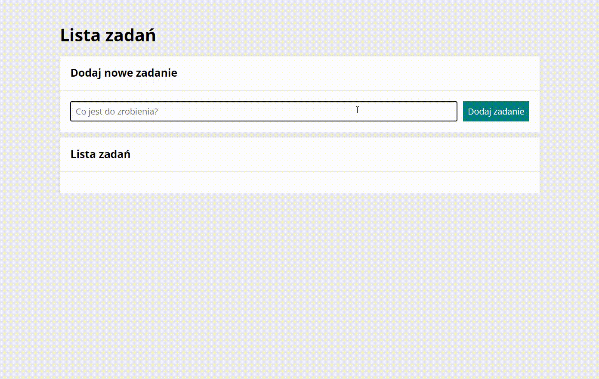

# ✅ To Do List  
This website is a to-do list that was further developed as a new [repository](https://github.com/olachrzan/to_do_list_react).

You can add new tasks and they will be displayed below. A great facilitation is that after saving a task, focus stays on the input, so you can enter several tasks in a row. Saved tasks can be marked as done by clicking the green button (then they will be crossed out) or they can be deleted by clicking the red button. It's also possible to interact on several buttons at once - you can hide/show completed tasks or mark all tasks as done.

## Overview

## Demo
You can find the demo [here](https://olachrzan.github.io/to_do_list/)

## Technologies
- HTML
- CSS
- JavaScript
- BEM
